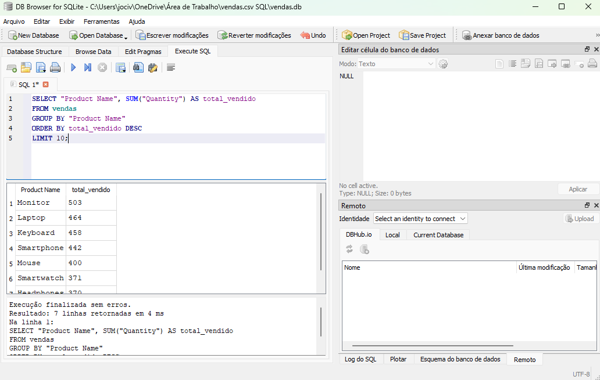
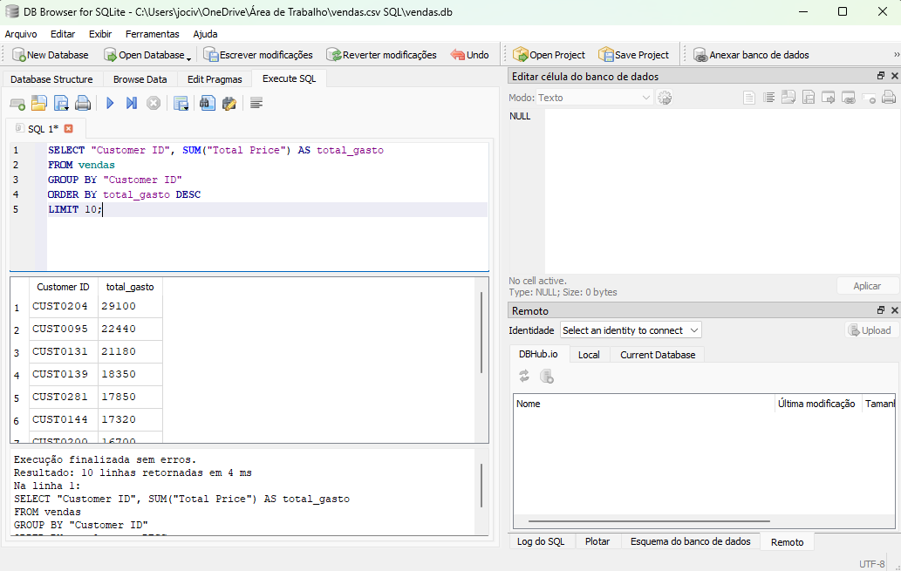
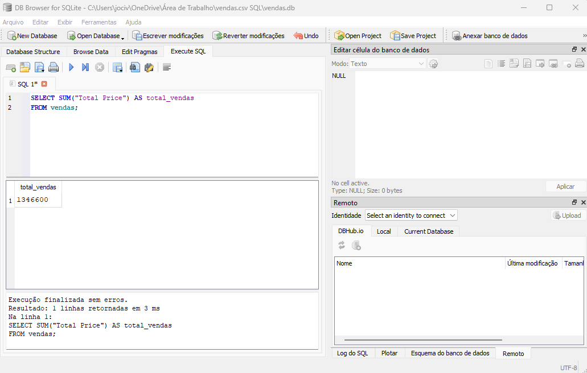
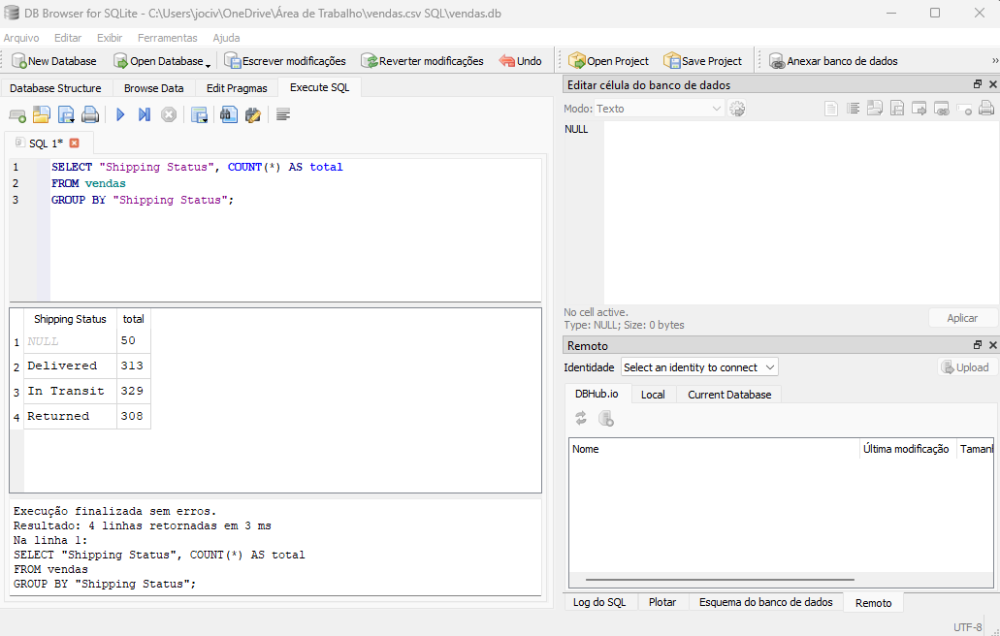
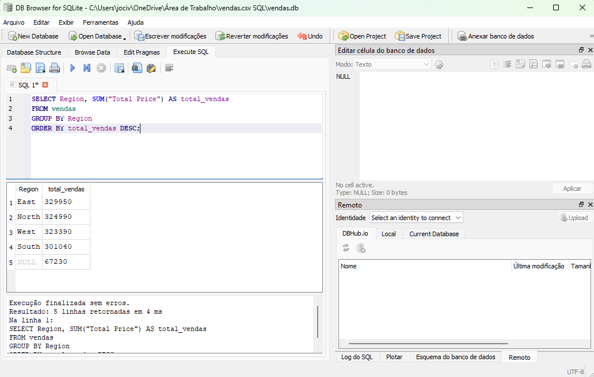

# 📊 Análise de Vendas com SQL

## 🎯 Objetivo
Analisar dados de vendas para identificar padrões, clientes mais valiosos e desempenho por região.

## 🛠️ Ferramentas utilizadas
- SQL (SQLite)
- DB Browser for SQLite

## 📂 Estrutura do projeto
- dados: base de dados em CSV
- queries: consultas SQL utilizadas
- prints: evidências das análises

## 📊 Principais análises
- Total de vendas
- Produtos mais vendidos
- Top clientes
- Vendas por região
- Status de entrega

## 💡 Insights
- Algumas regiões concentram maior volume de vendas
- Há clientes com alto valor de compra (ticket médio elevado)
- Distribuição de pedidos varia conforme status de entrega

## 📸 Exemplos

